```{r setup, include=FALSE}
options(htmltools.dir.version = FALSE)
knitr::opts_chunk$set(echo = TRUE)
```


---
## Outline.

* 'Minimal theory'

* Some studies on egocentric networks and individual differences.

* Current work: GENSI.

* Future work.

---
## Perhaps an odd talk? 

* Very much a psychology talk. With little links to evolutionary demography. --> So bear with me... .

* Towards the end clearer what purpose is and perhaps how these methods could be of use to some of you.


```{r, out.width = "400px", echo=FALSE, fig.align='center'}
knitr::include_graphics("https://media.giphy.com/media/xT5LMsDBjZO6yRYTmw/giphy.gif") # Giphy
```

---
## A splash of theory.

* Minimal theory. Perhaps too little, as focus on studies... .

* In Q & A, I can say more about theory and/or background.

* Overarching framework for this talk: 'The Social Brain Hypothesis'.

```{r, out.width = "300px", echo=FALSE, fig.align='center'}
 # photo by Jacopo Werther
```

---
## Social Brain Hypothesis.

One explanation for the evolution of (primate) 'intelligence'

neocortex ratio: neocortex / rest of brain (adjusts for body weight issues).

Figure from Dunbar (1998).

```{r out.width = "500px", echo=FALSE, fig.align='center'}
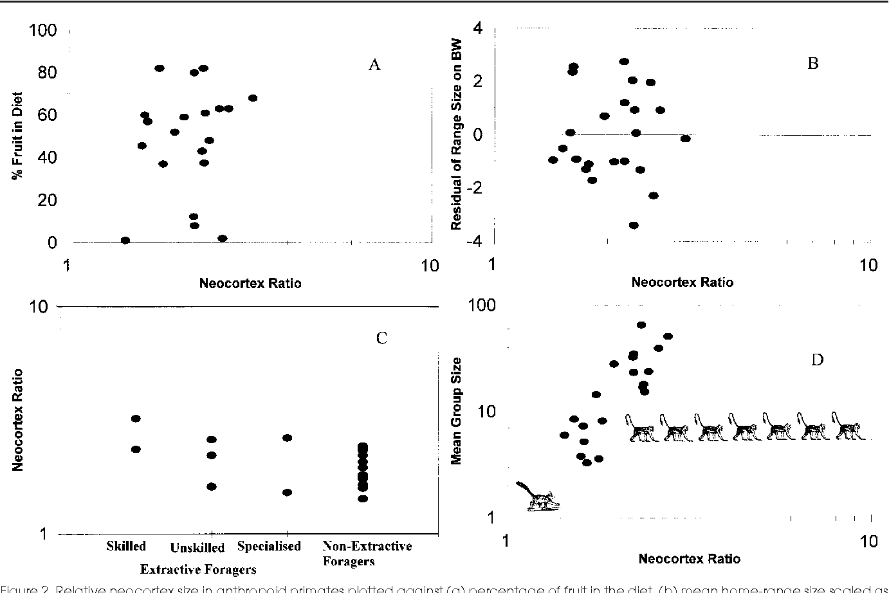 # Dunbar 1998
```


---
## Social Brain Hypothesis.

Dunbar & Shultz (2007)

```{r, out.width = "500px", echo=FALSE, fig.align='center'}
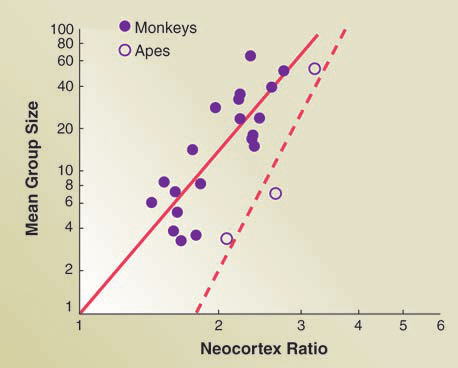 # Neocortex size, Dunbar & Shultz (2007)
```

---
## Dunbar's Number.

* Based on neocortex ratio: extrapolation based on data to suggest 'ancestral group size' ('150')

* More basic: 'Natural' limits to the number of people we can form relationships with. 

* **Time** + **Cognition**

```{r, out.width = "500px", echo=FALSE, fig.align='center'}
knitr::include_graphics("https://media.giphy.com/media/z8rEcJ6I0hiUM/giphy.gif") # Giphy
```

---
## Evidence?

* Evidence for +/- 150 number comes from a broad range of studies.

--

* Reviewed in Dunbar (2003, 2008). 

--

* Just some: Aboriginal clans (Dunbar, 1998), Yanomamö village sizes (Chagnon 1992), Archeological sites (Mesopotamia, New Guinea).

--

* Hutterites: split at 150.

--

* Egocentric social network studies (e.g., Hill & Dunbar's (2003) Christmas cards study)

---
## Not without criticism.

* How are relationships defined, for example? (De Ruiter et al., 2011).

* Evidence for smaller/larger structures? 

* How to apply to fission/fusion systems? 

* Other social network studies come up with larger numbers (and a lot of variability)

```{r, out.width = "500px", echo=FALSE, fig.align='center'}
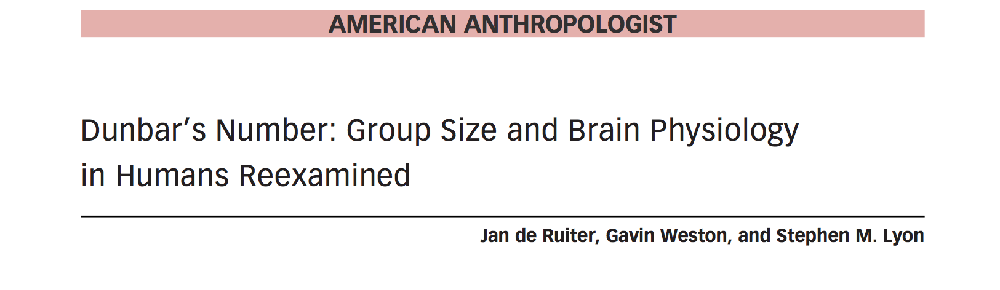 # De Ruiter 2011
```

---
## Social network: Not homogenous.

* Not everybody is as close to you... . Think about your romantic partner versus a random colleague who you only meet once a year at a conference.


```{r, out.width = "600px", echo=FALSE, fig.align='center', fig.cap='Diagram by Barbara Guidi'}
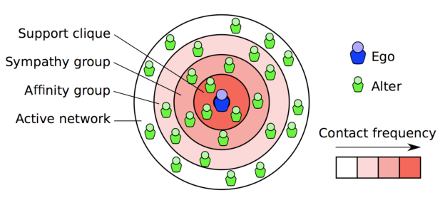 # Guidi, A distributed Dunbar-based Framework for Online Social Network
```

---
## Support clique / Sympathy group.

* Dunbar (2016) argues for +/- (max.) 5 for the support clique (support group) and around max. 15 for the sympathy group.

Sympathy group: 'considered to be close friends' and Support group: 'How many individuals they would ‘consider going to for advice or sympathy in times of great emotional or other distress'.

```{r, out.width = "300px", echo=FALSE, fig.align='center'}
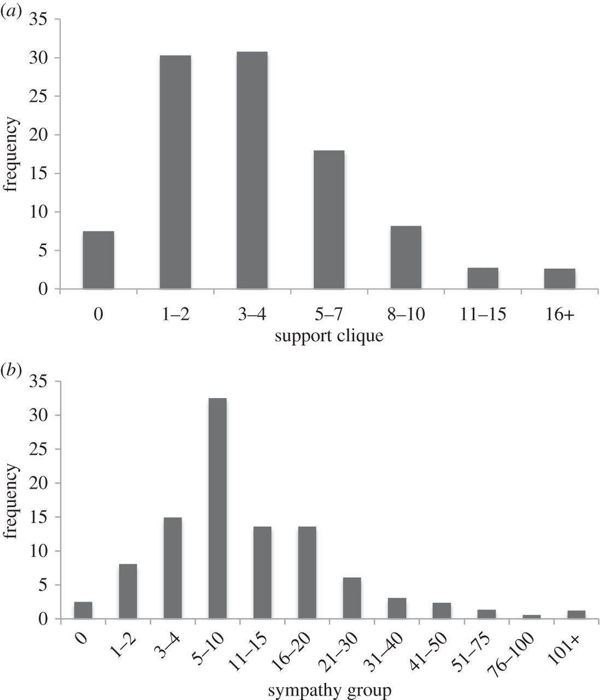
```

---
## Variation.

* You cannot be emotionally close to everybody... . Does adding more friends come at a cost?

* Notable individual differences: some people have much larger or smaller social network layers.

* Can we make sense of this variation?

--> Personality.

.pull-left[

]

.pull-right[

]

---
## Personality: Individual differences.

* Big 5 / Big 6 (HEXACO): Honesty/Humility - Emotionality - eXtraversion - Agreeableness - Conscientiousness - Openness to Experience. [www.hexaco.org](www.hexaco.org).

--

* Honesty–Humility: "Persons with very high scores on the Honesty-Humility scale avoid manipulating others for personal gain, feel little temptation to break rules, are uninterested in lavish wealth and luxuries, and feel no special entitlement to elevated social status. Conversely, persons with very low scores on this scale will flatter others to get what they want, are inclined to break rules for personal profit, are motivated by material gain, and feel a strong sense of self-importance."

--

* Emotionality: "Persons with very high scores on the Emotionality scale experience fear of physical dangers, experience anxiety in response to life's stresses, feel a need for emotional support from others, and feel empathy and sentimental attachments with others. Conversely, persons with very low scores on this scale are not deterred by the prospect of physical harm, feel little worry even in stressful situations, have little need to share their concerns with others, and feel emotionally detached from others."

---
## HEXACO (continued).

* eXtraversion: "Persons with very high scores on the Extraversion scale feel positively about themselves, feel confident when leading or addressing groups of people, enjoy social gatherings and interactions, and experience positive feelings of enthusiasm and energy. Conversely, persons with very low scores on this scale consider themselves unpopular, feel awkward when they are the center of social attention, are indifferent to social activities, and feel less lively and optimistic than others do."

--

* Agreeableness (versus Anger): "Persons with very high scores on the Agreeableness scale forgive the wrongs that they suffered, are lenient in judging others, are willing to compromise and cooperate with others, and can easily control their temper. Conversely, persons with very low scores on this scale hold grudges against those who have harmed them, are rather critical of others' shortcomings, are stubborn in defending their point of view, and feel anger readily in response to mistreatment."

---
## HEXACO (continued).

* Conscientiousness: "Persons with very high scores on the Conscientiousness scale organize their time and their physical surroundings, work in a disciplined way toward their goals, strive for accuracy and perfection in their tasks, and deliberate carefully when making decisions. Conversely, persons with very low scores on this scale tend to be unconcerned with orderly surroundings or schedules, avoid difficult tasks or challenging goals, are satisfied with work that contains some errors, and make decisions on impulse or with little reflection."

--

* Openness to Experience: "Persons with very high scores on the Openness to Experience scale become absorbed in the beauty of art and nature, are inquisitive about various domains of knowledge, use their imagination freely in everyday life, and take an interest in unusual ideas or people. Conversely, persons with very low scores on this scale are rather unimpressed by most works of art, feel little intellectual curiosity, avoid creative pursuits, and feel little attraction toward ideas that may seem radical or unconventional."


---
## Introversion/extraversion.

* Focus in particular: one dimension: Introversion/Extraversion.

--

* Stable individual differences. Does personality translate to the 'real world'?

--> Do people who are extraverted have more 'friends', also at these inner layers?

```{r, out.width = "300px", echo=FALSE, fig.align='center'}
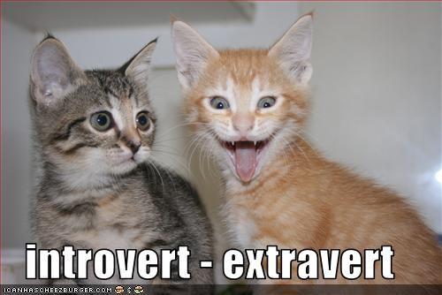 # I can has cheezburger.
```

---
## Previous research on Extraversion and 'offline' networks.

* Roberts et al. (2008) -  Extraversion positively associated support group (weekly contact) but not sympathy group size (monthly contact), (N=168)

* Effect no longer statistically significant after adjusting for age?

```{r, out.width = "300px", echo=FALSE, fig.align='center'}
knitr::include_graphics("https://media.giphy.com/media/ZZS5xe4Y7g5eo/giphy.gif") # Giphy
```

---
## Extension.

Surveying outer layers?

Paper on Extraversion in _Journal of Individual Differences_ (2011).

```{r, out.width = "400px", echo=FALSE, fig.align='center'}
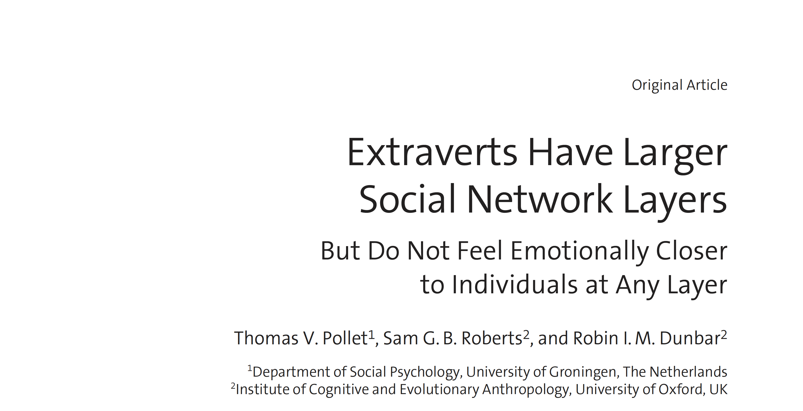 
```

---
## Study on all network layers

--

* N=117, recruited via 8 students (4 men / 4 women). All Dutch. 73 women and 44 men, with a mean age of 28 years (_SD_ = 12 years; range 18 to 63 years).

--

* Paper and pencil survey. Mapped out their social network (asked to go through phone and email lists). Also provided data on face-to-face contact, emotional closeness (score 1 to 10), etc.

--

* Support group: emotional closeness $\geq$ 8 AND at least weekly contact.

--

* Sympathy group: at least monthly contact.

--

* Introversion/Extraversion: 20 questions (e.g., "I am talkative" and "I like to share a lot with others.", Cronbach's $\alpha$ = .91).

```{r, out.width = "300px", echo=FALSE, fig.align='center'}
knitr::include_graphics("https://media.giphy.com/media/5htGFvTSehTxWdysds/giphy.gif") # Giphy
```

---
## Analyses

* Mean support group: 7 (_SD_ = 4). 

--

* Mean sympathy group: 11 (_SD_ = 8).

--

* Mean overall network size: 53 (_SD_ = 25) (Range: 9 to 147). 

--

* OLS regression(s): Extraversion significantly and positively associated support group, sympathy group size, and outer layer. (Upheld if accounted for relevant effects of partner status, gender, age.). But all $\beta$ s around .2 (_p_<.05).

--

* No effect of extraversion on average emotional closeness at each layer (all _p_>.38)

--

* Trade-offs between size and emotional closeness at the outer layer ( $\beta$ s around -.2) but not at other layers.

---
## Differences with Roberts et al. 2008.

* Dutch vs. UK?

* Definition.

* Remains underpowered? 

--> Larger sample.

```{r, out.width = "300px", echo=FALSE, fig.align='center'}
knitr::include_graphics("https://media.giphy.com/media/zjQrmdlR9ZCM/giphy.gif") # Giphy
```

---
## Molho et al. (2016) Personality and Individual Differences.

* 525 individuals completed social network survey and measures on personality (HEXACO).

--

* Recruited via personal networks of Masters students (Major Nationalities: 30% Dutch, 12% Germany, 9% U.S.). --> Remains W.E.I.R.D.

--

* 63.4% women, $\sf{Mean_{age}}$=27, $\sf{SD_{age}}$=10, range: 18 to 83 years. 

--

Sympathy group: "We would like you to think of the people who are most important to you, and to imagine not being able to speak or to
see these people ever again"

--

Support group: indicated which of these people they would turn to "in times of severe emotional or financial distress".

--

Rate Emotional Closeness for each network member (0-100 slider) (and a bunch of other things).

---
## Descriptive statistics.

* Mean support group size: 5 individuals (_SD_ = 3)

--

* Mean sympathy group, including support group members, 11 individuals (_SD_ = 6).

---
## HEXACO personality.

* Big 6, 60-item version of the HEXACO personality inventory (Ashton & Lee, 2009).

* Scales for all HEXACO dimensions showed adequate reliability: Honesty–Humility, Cronbach's $\alpha$ = .70; Emotionality, Cronbach's $\alpha$ = .76; Extraversion, Cronbach's $\alpha$ = .80; Agreeableness, Cronbach's $\alpha$ = .73; Conscientiousness, Cronbach's $\alpha$ = .77; and Openness to Experience, Cronbach's $\alpha$ = .76.

```{r, out.width = "400px", echo=FALSE, fig.align='center'}
knitr::include_graphics("https://media.giphy.com/media/12BUM3lo0ihYB2/giphy.gif")
```

---
## Network size.

OLS Regressions.

* support group: positive effects of extraversion (no notable effects of control)

* (net) sympathy group: no effect of personality (only language: those who reported 'Other' --> smaller network)

```{r, out.width = "1600x", echo=FALSE, fig.align='center'}
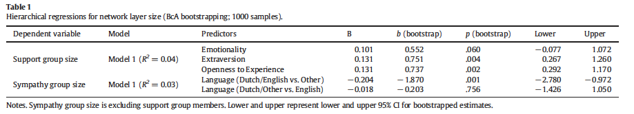
```

---
## Emotional closeness.

* No personality effects after adjusting for control variables. Except for Honesty-Humility effects (and marginal Extraversion effect?)

```{r, out.width = "1100px", echo=FALSE, fig.align='center'}
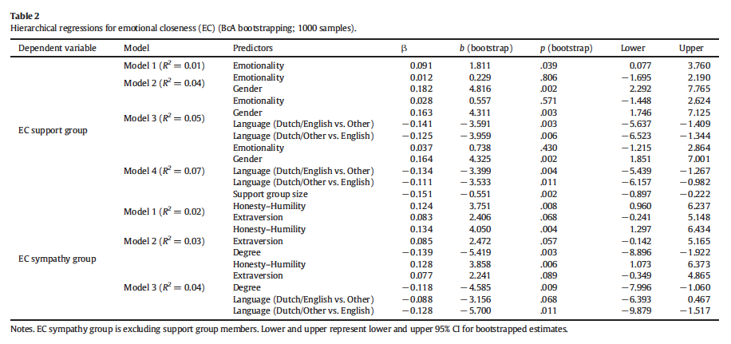
```


---
## Intermediary conclusion.

* Weak associations between extraversion and support group size.

* No robust evidence at other layers.

```{r, out.width = "500px", echo=FALSE, fig.align='center'}
knitr::include_graphics("https://media.giphy.com/media/DfmlrvtzmUbbG/giphy.gif")
```

---
## Personality and Facebook networks.  

* Brown et al. (in preparation). - Extraversion associated with Facebook Network size (and number of clusters).

* Preprint [here](https://psyarxiv.com/3zvhq/).

```{r, out.width = "500px", echo=FALSE, fig.align='center'}
knitr::include_graphics("https://media.giphy.com/media/xTiTnxM7bZ9200V2Eg/giphy.gif")
```

---
## Participants/Procedure materials.

* 107 students in a lab. setting. 71 women, 36 men between the ages of 18 to 32 years (_M_ = 20.6 years, _SD_ = 2.71 years) 

* Mapped out online/offline network, completed personality (and other measures).

* [Getnet](http://thepoliticsofsystems.net/category/social-networks/) - now 'dead'.

* [Gephi](http://www.gephi.org) to calculate common social network metrics. --> Density, Clustering.

---
## What did we find?

Unfortunately not much... . 

* Extraversion relates to Facebook Size. (Also to density/number of clusters, but this is a consequence of size).

```{r, out.width = "400px", echo=FALSE, fig.align='center'}
knitr::include_graphics("https://media.giphy.com/media/sRMPFaVQLGSw8/giphy.gif")
```

---
## (offline) Social network structure.

--> Previous studies did not examine the *structure* of these egocentric layers (offline networks). 


```{r,  out.width = "400px", echo=FALSE, fig.align='center', fig.cap='Illustration by Lee et al. (2013)'}
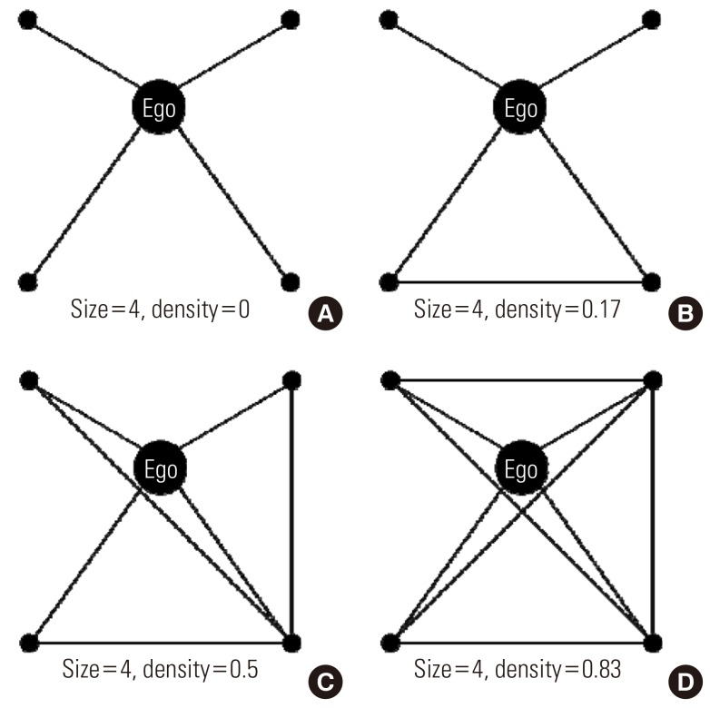
# Social Network Characteristics and Body Mass Index in an Elderly Korean Population - Scientific Figure on ResearchGate. Available from: https://www.researchgate.net/figure/Personal-network-density-A-D-According-to-the-connections-among-friends-alters-it_fig1_259355548 [accessed 19 Feb, 2019]
```

---
## Connor Malcolm's study.

* 200 individuals recruited. Completed measures on introversion/extraversion (Cronbach's $\alpha$ = .88)  and loneliness (Cronbach's $\alpha$ = .77).

--

* "From time to time, most people discuss important matters with other people they trust. These important matters may be personal or social. The people with whom you discuss important matters may be friends, family or co-workers. Looking back over the last six months, who are the people with whom you discussed matters important to you over the telephone, text or in person?"

--

* Listed up to 10 individuals.

---
## Why study loneliness?

* Loneliness equivalent to smoking 15 cigarettes a day (Holt-Lunstad et al., 2010)

* Perhaps surprisingly loneliness very prevalent in young adult populations (especially in urban neighbourhoods, Matthews et al. 2019).  

* National campaign to end loneliness.

* If we want to tackle loneliness, we need to understand it better. Problem of not enough close friends, or not feeling embedded? (Or both?)

```{r, out.width = "400px", echo=FALSE, fig.align='center'}
knitr::include_graphics("https://media.giphy.com/media/raf86zLiQizfy/giphy.gif")
```


---
## GENSI

http://www.tobiasstark.nl/GENSI/GENSI.htm (Gert Stulp's EHBEA Talk) - Some hiccups... .

**Thomas clicks this [link](https://gensi.cocolab.org) and hopes for the best... .**


```{r, out.width = "600px", echo=FALSE, fig.align='center'}
knitr::include_graphics("https://media.giphy.com/media/4KxeicCUTvhrW/giphy.gif")
```

---
## Extraversion.

No notable relationship with density but number of ties.

```{r, out.width = "600px", echo=FALSE, fig.align='center'}
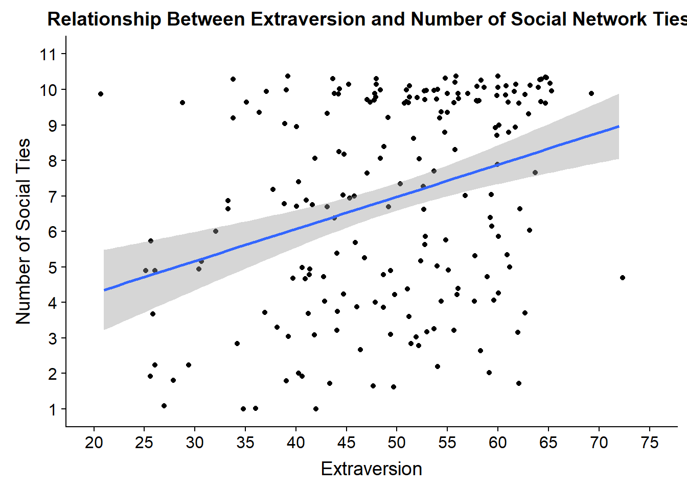
```

---
## Extraversion: subcomponents.

```{r, out.width = "600px", echo=FALSE, fig.align='center'}
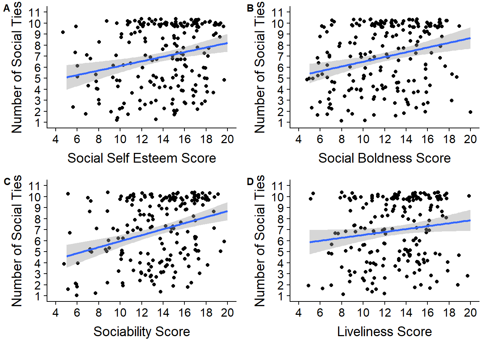
```

---
## Loneliness

No notable relationship with number of ties but associations with density. (Note extraversion and loneliness are not correlated).

```{r, out.width = "400px", echo=FALSE, fig.align='center'}
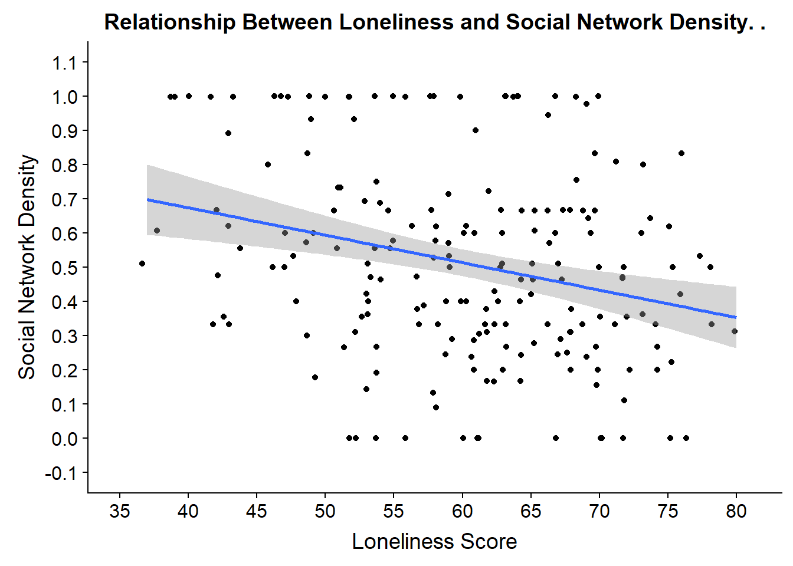
```

---
## Limitations.

* Rather basic stuff... .

* What I presented is very much based on W.E.I.R.D. samples. No idea whether this generalises.

* Definitions varied of support/sympathy group. Should we return to studying the outer layer (fatigue?).

* Underpowered in some cases? Confounding?

---
## Future work: Studies

* Does Instagram help to reduce loneliness (or increase it)? (funded by Facebook). Cross-sectional study + Longitudinally studying network change in first-years.

--

* How do relationships form and decay when people move to university? How do they relate to loneliness and living on vs. off campus?

--

* Loneliness in the elderly. Is it a matter of _any_ contact or specific contacts? Can we use Facetime/Skype to alleviate loneliness?

--

* Mapping out support networks of various support groups (e.g., military veterans - Dr. Gemma Wilson). Does it help or harm to have support from those who are similar to you? Does it vary based on domain (e.g., advice/finance?)

--

* Do those who have body image issues preferentially assort with those holding similar views (with Prof. Piers Cornelissen)

--

* Open to other collaborations... .

---
## Egocentric network analysis.

```{r, out.width = "600px", echo=FALSE, fig.align='center'}

```

---
## ERGM.ego in R.

* This package seems amazing.

* Allows estimation of network processes from egocentric network data (!).

* Case study: HIV patterns and subgroups simulated from egocentric network data.

* [https://statnet.github.io/Workshops/ergm.ego_tutorial.html](https://statnet.github.io/Workshops/ergm.ego_tutorial.html)


---
## Why should you care?

* Useful tool or not?

--

* Quantifying different types of support (emotional, financial, advice). Does it help or harm to have those similar to you?

--

* Studies on childcare tend to look at individuals (grandparents, siblings, etc) rather than networks? Does density matter?

--

* Questions about homophily in networks. Like attracts like? Separating selection from influence effects?

---
## Any Questions?

[http://tvpollet.github.io](http://tvpollet.github.io)

Twitter: @tvpollet

```{r, out.width = "600px", echo=FALSE, fig.align='center'}
knitr::include_graphics("https://media.giphy.com/media/3ohzdRoOp1FUYbtGDu/giphy.gif")
```

---
## Acknowledgments

* Numerous students (completion and data processing, in particular Research Masters students (Catherine Molho, Jane Conway, Riana Brown, Marit Eidt, Mina Tulin,Connor Malcolm))

* Numerous colleagues (especially: Sam Roberts, Robin Dunbar). Any mistakes are my own.

* Gert Stulp and Kris McCarty for GENSI trouble shooting.

* Those who have funded me (not these studies per se): [NWO](www.nwo.nl), [Templeton](www.templeton.org), [NIAS](http://nias.knaw.nl).

* You for listening!

```{r, out.width = "300px", echo=FALSE, fig.align='center'}
knitr::include_graphics("https://media.giphy.com/media/10avZ0rqdGFyfu/giphy.gif")
```

